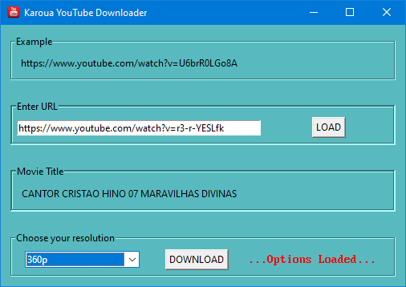
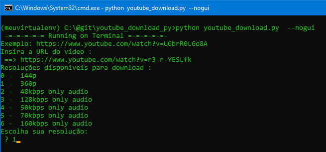

<!DOCTYPE html>
<html lang = "en">
  <head></head>
  <body>
	# Karoua Youtube Download GUI

	<h2>Download youtube videos</h2>

	
Hi.

	
There are many youtube downloaders scattered around the web.
	 Many of them non-functional or have lots of garbage  such  as 
	 ads, malwares, anoying messages and so on.

	My software is straight to the point:

	<ul>
	  <li>Insert youtube link</li>
	  <li>Choose resolution</li>
	  <li>Download</li>
	</ul>      

	This version has a GUI interface but it also runs on CLI.

	<h2>Running with GUI interface:</h2>
	
python youtube_download.py</>
	 
	</img>
	 
	<h2>Running with CLI interface:</h2>
	
python youtube_download.py --nogui

	 
	</img>
	 
	Enjoy!
  </body>

</html>